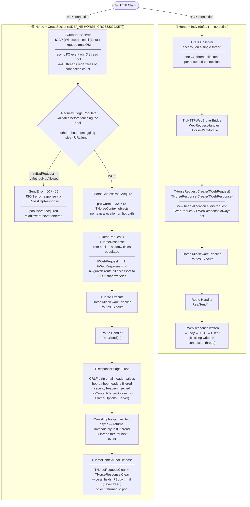
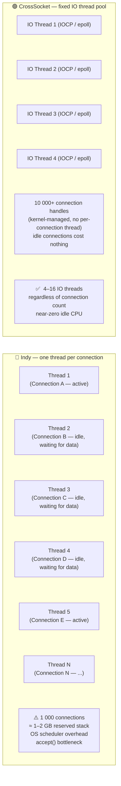
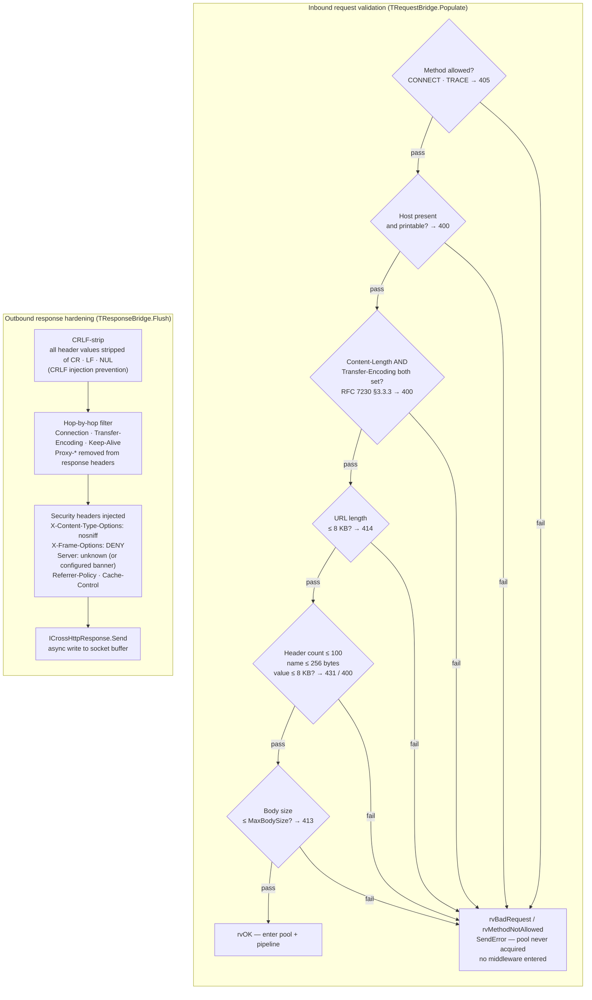
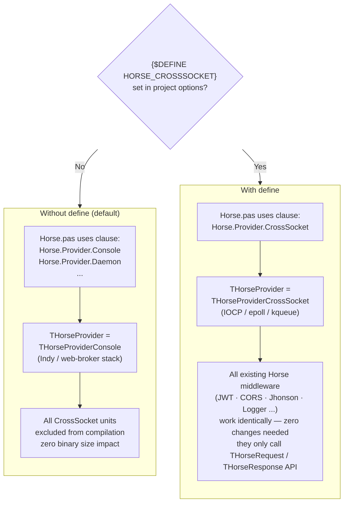

# Horse Transport Architecture — Indy vs CrossSocket

| # | Diagram | What it explains |
|---|---|---|
| 1 | **Request lifecycle** | Full path from TCP accept to response for both Indy and CrossSocket — shows the pool, validation, shadow fields, and flush steps |
| 2 | **Thread model** | Why Indy hits a wall at ~1 000 connections (N threads = N stacks) vs CrossSocket's fixed IO thread pool serving 10 000+ |
| 3 | **Object lifecycle** | Indy: allocate + free on every request. CrossSocket: pre-warm pool at startup, `Clear()` on reuse, no allocator on the hot path |
| 4 | **Security boundary** | All 6 validation checks in `TRequestBridge.Populate` (inbound) + CRLF-strip / hop-by-hop filter / security header injection (outbound) |
| 5 | **Activation** | Single compiler define switches `THorseProvider` type alias — existing middleware is untouched and unaware |

---

## 1. Request lifecycle comparison

---

## 2. Thread model

---

## 3. Object lifecycle

```mermaid
flowchart TD
    subgraph INDY_OBJ["🔵  Indy — allocate / free per request"]
        direction LR
        IA["Request arrives"] --> IB["new THorseRequest\nnew THorseResponse\nnew TDictionary (headers)\nnew TDictionary (params)\n..."]
        IB --> IC["Pipeline runs"]
        IC --> ID["Free THorseRequest\nFree THorseResponse\nFree all dictionaries"]
        ID --> IE["GC pressure under load\nOS allocator called on every request"]
    end

    subgraph CS_OBJ["🟢  CrossSocket — pre-warmed pool, Clear on reuse"]
        direction LR
        CA["Startup\nTHorseContextPool.WarmUp"] --> CB["32 × THorseContext\npre-allocated\n(THorseRequest + THorseResponse\n+ all dictionaries)"]
        CB --> CC{"Request arrives\nAcquire from pool"}
        CC -->|"pool has free object"| CD["Populate shadow fields\nno heap allocation"]
        CC -->|"pool exhausted\n(burst load)"| CE["Create new THorseContext\n(pool grows up to 512)"]
        CD --> CF["Pipeline runs"]
        CE --> CF
        CF --> CG["Release to pool\nClear() — wipes all fields\nFBody := nil direct assign\n(never frees — CrossSocket owns stream)"]
        CG --> CC
    end
```

---

## 4. Security boundary

---

## 5. Activation — single compiler define

